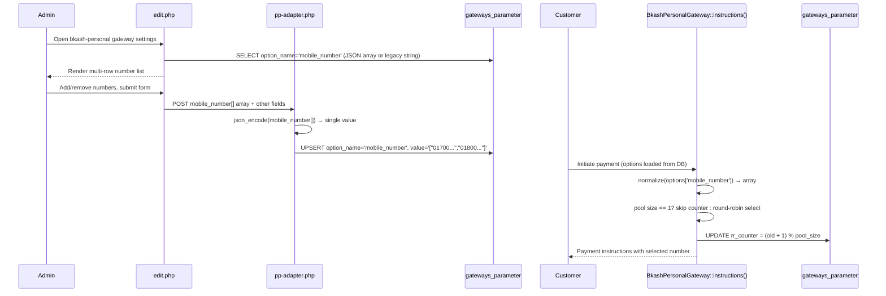

# Design Document: bkash-personal Multi-Number Support

## Overview

This feature extends the `bkash-personal` payment gateway to support a pool of bKash personal numbers instead of a single number. When a customer initiates a payment, the system selects one number from the pool using round-robin and presents it in the payment instructions. The change is backward-compatible: existing single-number configurations continue to work without any database migration.

The scope of changes is narrow — three files are modified:

| File | Change |
|---|---|
| `bkash-personal/class.php` | Normalize `mobile_number` to array, apply round-robin selection |
| `gateways/edit.php` | Replace single text input with dynamic multi-row UI for `bkash-personal` slug |
| `pp-adapter.php` | Serialize `mobile_number[]` POST array to JSON before upsert |

---

## Architecture



---

## Components and Interfaces

### 1. `BkashPersonalGateway` (class.php)

**New private helper — `normalizePool(mixed $raw): array`**

Converts the raw stored value to a PHP array:
- If `$raw` is already an array → return it as-is (filtered of empty strings).
- If `$raw` is a non-empty string that is valid JSON → `json_decode` it.
- If `$raw` is a plain non-empty string → wrap in `[$raw]`.
- Otherwise → return `[]`.

**New private helper — `selectNumber(array $pool, array &$options, string $gatewayId, string $brandId): string`**

Implements round-robin selection:
1. If `count($pool) === 0` → return `''`.
2. If `count($pool) === 1` → return `$pool[0]` (no counter update).
3. Read `$counter = (int)($options['rr_counter'] ?? 0)`.
4. `$selected = $pool[$counter % count($pool)]`.
5. `$newCounter = ($counter + 1) % count($pool)`.
6. Persist `$newCounter` to `gateways_parameter` via a direct DB upsert (using the global `$db_prefix` and existing `updateData`/`insertData` helpers).
7. Return `$selected`.

**Modified `instructions($data)`**

Replace the single `$mobileNumber = $options['mobile_number'] ?? ''` line with:
```php
$pool   = $this->normalizePool($options['mobile_number'] ?? '');
$mobileNumber = $this->selectNumber($pool, $options, $data['gateway']['gateway_id'], $data['brand']['id']);
```

The rest of the method is unchanged.

---

### 2. Admin Edit Page (edit.php)

**Condition for bkash-personal slug**

Inside the `gateway_type == 'automation'` block, before pushing the generic `mobile_number` text field into `$extraFields`, check the slug:

```php
if ($slug === 'bkash-personal') {
    // inject multi-number field descriptor instead
    $extraFields[] = [
        'name'  => 'mobile_number',
        'label' => 'Mobile Numbers',
        'type'  => 'multi_mobile',   // custom type handled in the switch below
    ];
} else {
    $extraFields[] = [
        'name'  => 'mobile_number',
        'label' => 'Mobile Number',
        'type'  => 'text',
        ...
    ];
}
```

**New `case 'multi_mobile'` in the field-rendering switch**

The stored `$value` for `mobile_number` is either a JSON array string or a legacy plain string. Normalize it to a PHP array for rendering:

```php
case 'multi_mobile':
    $numbers = [];
    if (!empty($value)) {
        $decoded = json_decode($value, true);
        $numbers = is_array($decoded) ? $decoded : [$value];
    }
    if (empty($numbers)) $numbers = [''];  // at least one empty row

    echo '<div id="mobile-number-list">';
    foreach ($numbers as $num) {
        echo '<div class="input-group mb-2 mobile-number-row">
                <input type="text" class="form-control" name="mobile_number[]"
                       value="' . htmlspecialchars($num) . '"
                       placeholder="01XXXXXXXXX"
                       pattern="^01[0-9]{9}$"
                       title="11-digit Bangladeshi number starting with 01">
                <button type="button" class="btn btn-danger remove-number-btn">
                  <svg ...><!-- trash icon --></svg>
                </button>
              </div>';
    }
    echo '</div>';
    echo '<button type="button" id="add-mobile-number" class="btn btn-secondary btn-sm mt-1">+ Add Number</button>';
    echo '<div id="mobile-number-error" class="text-danger mt-1" style="display:none">
            At least one mobile number is required.
          </div>';
    break;
```

**Inline JavaScript (appended once, guarded by slug check)**

```javascript
// Only injected when slug === 'bkash-personal'
document.getElementById('add-mobile-number').addEventListener('click', function () {
    const list = document.getElementById('mobile-number-list');
    const row  = list.querySelector('.mobile-number-row').cloneNode(true);
    row.querySelector('input').value = '';
    list.appendChild(row);
});

document.getElementById('mobile-number-list').addEventListener('click', function (e) {
    if (e.target.closest('.remove-number-btn')) {
        const rows = this.querySelectorAll('.mobile-number-row');
        if (rows.length > 1) {
            e.target.closest('.mobile-number-row').remove();
        }
    }
});

// Pre-submit validation
document.querySelector('.form-submit').addEventListener('submit', function (e) {
    const inputs  = document.querySelectorAll('[name="mobile_number[]"]');
    const pattern = /^01[0-9]{9}$/;
    const valid   = Array.from(inputs).filter(i => pattern.test(i.value.trim()));
    if (valid.length === 0) {
        e.preventDefault();
        document.getElementById('mobile-number-error').style.display = 'block';
    }
});
```

---

### 3. Backend Save Handler (pp-adapter.php)

The existing loop already handles array POST values with `json_encode($value)`. The only required change is to **strip whitespace-only entries** before encoding, and to ensure `mobile_number[]` is not skipped by the system-fields exclusion list.

In the `foreach ($_POST as $key => $value)` loop, add a special case before the generic array handler:

```php
if ($key === 'mobile_number' && is_array($value)) {
    // Filter blank/whitespace entries
    $filtered = array_values(array_filter($value, fn($n) => trim($n) !== ''));
    $value = json_encode($filtered);
    $configData[$key] = $value;
    continue;
}
```

This runs before the generic `is_array($value) → json_encode($value)` branch, so no other change is needed.

---

## Data Models

### `gateways_parameter` table (unchanged schema)

| Column | Type | Notes |
|---|---|---|
| `id` | int PK | auto-increment |
| `brand_id` | varchar | tenant identifier |
| `gateway_id` | varchar | gateway instance identifier |
| `option_name` | varchar | e.g. `mobile_number`, `rr_counter` |
| `value` | text | stored value |

**`mobile_number` row** — value is a JSON-encoded array:
```json
["01700000001", "01800000002", "01900000003"]
```

Legacy single-string value (`"01700000001"`) is normalized at read time by `normalizePool()` — no migration needed.

**`rr_counter` row** — value is a plain integer string, e.g. `"2"`. It is only read and written by `BkashPersonalGateway::selectNumber()`. It is never submitted from the admin form (not a `$_POST` key), so the adapter loop never touches it.

### Pool size constraints

- Minimum: 1 number (enforced by client-side JS and server-side filter)
- Maximum: 20 numbers (enforced by client-side JS; server-side the adapter silently truncates to 20 if exceeded)

---

## Correctness Properties

*A property is a characteristic or behavior that should hold true across all valid executions of a system — essentially, a formal statement about what the system should do. Properties serve as the bridge between human-readable specifications and machine-verifiable correctness guarantees.*

### Property 1: Serialization round-trip

*For any* non-empty array of mobile number strings, JSON-encoding it and then JSON-decoding the result should produce an array equal to the original.

**Validates: Requirements 1.1, 1.2**

---

### Property 2: Whitespace entries are stripped before save

*For any* array of mobile number strings that includes one or more entries composed entirely of whitespace, the filtered array passed to `json_encode` should contain none of those whitespace entries.

**Validates: Requirements 1.4**

---

### Property 3: `normalizePool` always returns an array

*For any* value stored in `options['mobile_number']` — whether a plain string, a JSON-encoded array string, an already-decoded PHP array, or an empty/null value — `normalizePool()` should always return a PHP array (never a string, null, or other type).

**Validates: Requirements 1.5, 5.1, 5.3**

---

### Property 4: Round-robin selection is always a pool member

*For any* non-empty pool of mobile numbers and any non-negative integer counter value, the number returned by `selectNumber()` should be an element of that pool.

**Validates: Requirements 3.1, 3.2**

---

### Property 5: Round-robin counter advances correctly

*For any* pool of size N (N ≥ 2) and any counter value C, after one call to `selectNumber()` the new persisted counter should equal `(C + 1) % N`.

**Validates: Requirements 3.2, 3.3, 3.4**

---

### Property 6: Payment instructions carry the selected number

*For any* non-empty pool of mobile numbers, `BkashPersonalGateway::instructions()` should return an array whose third element (index 2) has `vars['{mobile_number}']` and `value` both equal to the number chosen by `selectNumber()`.

**Validates: Requirements 4.1, 4.2**

---

### Property 7: Mobile number validator accepts exactly valid Bangladeshi numbers

*For any* string, the client-side regex validator (`/^01[0-9]{9}$/`) should accept it if and only if it is exactly 11 characters, starts with `01`, and the remaining 9 characters are digits.

**Validates: Requirements 2.4**

---

## Error Handling

| Scenario | Handling |
|---|---|
| `mobile_number` missing from options | `normalizePool` returns `[]`; `selectNumber` returns `''`; instructions render with empty value |
| Legacy plain-string value in DB | `normalizePool` wraps in single-element array; no DB migration needed |
| Malformed JSON in DB | `json_decode` returns `null`; `normalizePool` falls back to treating raw value as plain string |
| `rr_counter` missing from DB | Defaults to `0`; first number in pool is selected; counter row is inserted |
| All submitted `mobile_number[]` entries are blank | Adapter filter produces `[]`; stored as `"[]"`; gateway returns empty string |
| Admin submits > 20 numbers | Server-side: `array_slice($filtered, 0, 20)` before encode; client-side JS disables "Add Number" at 20 rows |
| DB write failure on `rr_counter` update | Selection still returns the chosen number; counter may not advance (best-effort, non-fatal) |

---

## Testing Strategy

### Unit tests (example-based)

- `normalizePool('')` → `[]`
- `normalizePool('01700000001')` → `['01700000001']`
- `normalizePool('["01700000001","01800000002"]')` → `['01700000001','01800000002']`
- `normalizePool(['01700000001'])` → `['01700000001']`
- `selectNumber([], ...)` → `''`
- `selectNumber(['01700000001'], ...)` → `'01700000001'`, counter unchanged
- Adapter filter: `['01700000001', '  ', '']` → `json_encode(['01700000001'])`
- Edit page renders N rows for a pool of N numbers (snapshot)
- Edit page for non-bkash-personal slug still renders single text input

### Property-based tests

Using a PHP property-based testing library (e.g. [eris](https://github.com/giorgiosironi/eris) or a simple custom generator loop).

Each property test runs a minimum of **100 iterations**.

Tag format: `Feature: bkash-personal-multi-number, Property {N}: {property_text}`

| Property | Generator | Assertion |
|---|---|---|
| P1 — Serialization round-trip | Random arrays of 1–20 valid number strings | `json_decode(json_encode($arr)) === $arr` |
| P2 — Whitespace stripped | Random arrays mixing valid numbers and whitespace-only strings | Filtered result contains no whitespace-only entries |
| P3 — normalizePool always array | Random mix of: plain strings, JSON strings, PHP arrays, null, empty string | `is_array(normalizePool($v)) === true` |
| P4 — Selection is pool member | Random non-empty pool (1–20 items), random counter (0–999) | `in_array(selectNumber($pool, $counter), $pool)` |
| P5 — Counter advances correctly | Random pool size N ≥ 2, random counter C | `newCounter === ($C + 1) % N` |
| P6 — Instructions carry selected number | Random non-empty pool, random counter | `instructions()[2]['value'] === selectNumber($pool, $counter)` |
| P7 — Validator accepts valid numbers only | Random strings (mix of valid and invalid) | `preg_match('/^01[0-9]{9}$/', $s) === expectedResult` |

### Integration tests

- Save a multi-number configuration via the adapter and read it back from `gateways_parameter` (1–2 examples).
- Load a legacy single-string gateway, open edit page, save, verify stored value is now a JSON array.
- Full payment flow: pool of 3 numbers, initiate 6 payments, verify each number is selected exactly twice in round-robin order.
