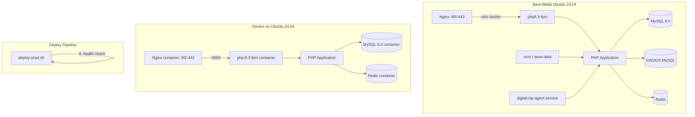

# Design Document: Ubuntu 24.04 Deployment Readiness

## Overview

This document describes the technical design for making the FCNCHBD ISP ERP system fully deployable on Ubuntu 24.04 LTS (Noble Numbat). Ubuntu 24.04 ships PHP 8.3 as the default, uses `php8.3-fpm` as the FastCGI process manager, and introduces updated package names, socket paths, and systemd service names compared to Ubuntu 22.04.

The system is a PHP 8.1+ application with MySQL/SQLite databases, FreeRADIUS integration, a Python agent component, Nginx web server, Docker Compose-based deployment, and multiple cron jobs. All twelve requirement areas must be addressed to achieve a zero-manual-intervention deployment on a fresh Ubuntu 24.04 server.

### Key Changes from Ubuntu 22.04

| Area | Ubuntu 22.04 | Ubuntu 24.04 |
|------|-------------|-------------|
| Default PHP | 8.1 | 8.3 |
| PHP-FPM socket | `/run/php/php8.1-fpm.sock` | `/run/php/php8.3-fpm.sock` |
| PHP-FPM service | `php8.1-fpm` | `php8.3-fpm` |
| MySQL default | 8.0 | 8.0 (unchanged) |
| Docker Compose | v1 (`docker-compose`) | v2 (`docker compose`) |
| Python | 3.10 | 3.12 |

---

## Architecture

The deployment architecture has two modes: **bare-metal** (direct Ubuntu install) and **Docker** (containerized). Both modes share the same application code and environment configuration.



### Component Responsibilities

- **deploy-prod.sh / deploy-staging.sh / deploy-dev.sh**: Orchestrate the full deployment lifecycle with Ubuntu 24.04-aware commands.
- **setup-ubuntu24.sh**: One-time server provisioning script that installs all system packages, creates the Python venv, and registers the systemd service.
- **docker/nginx/nginx-ubuntu24.conf**: Nginx site configuration for bare-metal Ubuntu 24.04 deployments.
- **docker/php/php.ini** (production variant): PHP runtime settings with `display_errors = Off`.
- **digital-isp-agent.service**: systemd unit for the Python agent.

---

## Components and Interfaces

### 1. PHP Version Detection and FPM Reload (Requirements 1, 12)

The deploy scripts must detect the active PHP version and use the correct FPM service name. The detection logic follows a priority order:

```
php8.3-fpm → php8.2-fpm → php8.1-fpm → error
```

**Interface: `detect_php_fpm_service()`** (shell function)
- Input: none (reads system state via `systemctl is-active`)
- Output: service name string (e.g., `php8.3-fpm`) or exits with error
- Side effects: none

**Interface: `check_php_version()`** (shell function)
- Input: none (reads `php --version` output)
- Output: version string (e.g., `8.3.6`)
- Exits non-zero if version < 8.1

### 2. Package Dependency Checker (Requirement 2)

A shell function that verifies all required packages are installed before proceeding.

**Required PHP packages (Ubuntu 24.04):**
```
php8.3-fpm php8.3-mysql php8.3-mbstring php8.3-curl
php8.3-gd php8.3-zip php8.3-xml php8.3-redis php8.3-sqlite3
```

**Required system tools:**
```
nginx mysql-client git curl composer
```

**Interface: `check_required_packages()`** (shell function)
- Input: array of package names
- Output: list of missing packages (stdout), exit code 1 if any missing
- Uses `dpkg -l` for package checks, `command -v` for tool checks

### 3. Nginx Configuration for Ubuntu 24.04 (Requirement 3)

A new file `docker/nginx/nginx-ubuntu24.conf` is the bare-metal site configuration. It differs from the Docker config in one critical way: it uses a Unix socket instead of a TCP upstream.

**Key directives:**
```nginx
fastcgi_pass unix:/run/php/php8.3-fpm.sock;
root /var/www/digital-isp/public;
```

The file is installed to `/etc/nginx/sites-available/digital-isp` and symlinked to `/etc/nginx/sites-enabled/digital-isp`.

### 4. Migration Runner (Requirement 4)

The deploy script applies migrations from `database/migrations/` in lexicographic filename order. A migration tracking table (`_migrations`) records applied migrations to enable idempotent re-runs.

**Migration tracking table schema:**
```sql
CREATE TABLE IF NOT EXISTS _migrations (
    id INT AUTO_INCREMENT PRIMARY KEY,
    filename VARCHAR(255) NOT NULL UNIQUE,
    applied_at TIMESTAMP DEFAULT CURRENT_TIMESTAMP
);
```

**Interface: `run_migrations()`** (shell function)
- Input: DB connection params from `.env`
- For each `.sql` file in lexicographic order:
  - Check if filename exists in `_migrations` table
  - If yes: log warning and skip
  - If no: apply migration, insert record into `_migrations`

### 5. Environment Validator (Requirement 5)

A shell function that validates all required environment variables before any deployment action.

**Required variables:**
```
APP_KEY APP_URL DB_HOST DB_DATABASE DB_USERNAME DB_PASSWORD JWT_SECRET
```

**Placeholder patterns to reject:**
```
REPLACE  your_  change_  example  placeholder
```

**Interface: `validate_env()`** (shell function)
- Input: `.env` file path
- Output: list of failing variables (stdout), exit code 1 if any fail
- Additional check: if `APP_ENV=production`, verify `APP_DEBUG=false`

### 6. File Permissions Manager (Requirement 6)

The deploy script applies a consistent permission model:

| Path | Owner | Permissions |
|------|-------|-------------|
| `storage/` (recursive) | `www-data:www-data` | `775` (dirs), `664` (files) |
| `public/uploads/` (recursive) | `www-data:www-data` | `775` |
| PHP application files | `root:www-data` | `644` |
| PHP application directories | `root:www-data` | `755` |
| `.env` (production) | `root:www-data` | `640` |
| SQLite database files | `www-data:www-data` | `664` |

### 7. Cron Job Manager (Requirement 7)

The deploy script manages cron entries for the `www-data` user using a marker comment to identify application-owned entries, enabling idempotent replacement.

**Marker comment:** `# digital-isp-cron`

**Cron schedule:**
```cron
# digital-isp-cron
0 0 * * * /usr/bin/php8.3 /var/www/digital-isp/cron_automation.php >> /var/www/digital-isp/storage/logs/automation_cron.log 2>&1
0 8 * * * /usr/bin/php8.3 /var/www/digital-isp/cron_automation.php due-reminders >> /var/www/digital-isp/storage/logs/automation_cron.log 2>&1
0 */6 * * * /usr/bin/php8.3 /var/www/digital-isp/cron_automation.php suspend >> /var/www/digital-isp/storage/logs/automation_cron.log 2>&1
5 0 * * * /usr/bin/php8.3 /var/www/digital-isp/cron_radius_rollup.php >> /var/www/digital-isp/storage/logs/automation_cron.log 2>&1
10 0 * * * /usr/bin/php8.3 /var/www/digital-isp/cron_selfhosted_piprapay.php >> /var/www/digital-isp/storage/logs/automation_cron.log 2>&1
```

**Interface: `install_cron_jobs()`** (shell function)
- Reads current `www-data` crontab
- Removes all lines between `# digital-isp-cron` markers
- Appends new entries
- Writes back with `crontab -u www-data`

### 8. Docker Compose Version Detector (Requirements 8, 12)

```bash
detect_docker_compose() {
    if docker compose version &>/dev/null 2>&1; then
        echo "docker compose"
    elif command -v docker-compose &>/dev/null; then
        echo "docker-compose"
    else
        echo ""
    fi
}
```

All deploy scripts use `$(detect_docker_compose)` as the compose command prefix.

### 9. SSL/TLS Configuration (Requirement 9)

The `nginx-ubuntu24.conf` includes both HTTP (port 80 → redirect) and HTTPS (port 443) server blocks. The HTTPS block is commented out by default and activated by the deploy script when certificate files exist.

**TLS settings:**
```nginx
ssl_protocols TLSv1.2 TLSv1.3;
ssl_ciphers ECDHE-ECDSA-AES128-GCM-SHA256:ECDHE-RSA-AES128-GCM-SHA256:ECDHE-ECDSA-AES256-GCM-SHA384:ECDHE-RSA-AES256-GCM-SHA384:DHE-RSA-AES128-GCM-SHA256;
ssl_prefer_server_ciphers off;
ssl_session_cache shared:SSL:10m;
ssl_session_timeout 1d;
```

### 10. Log Rotation (Requirement 10)

A logrotate configuration is installed at `/etc/logrotate.d/digital-isp`:

```
/var/www/digital-isp/storage/logs/*.log {
    daily
    rotate 30
    compress
    delaycompress
    missingok
    notifempty
    create 664 www-data www-data
    postrotate
        /bin/kill -USR1 $(cat /run/php/php8.3-fpm.pid 2>/dev/null) 2>/dev/null || true
    endscript
}
```

### 11. Python Agent systemd Service (Requirement 11)

The systemd unit file at `/etc/systemd/system/digital-isp-agent.service`:

```ini
[Unit]
Description=FCNCHBD ISP Agent
After=network.target

[Service]
Type=simple
User=www-data
Group=www-data
WorkingDirectory=/var/www/digital-isp/agent
ExecStart=/var/www/digital-isp/agent/venv/bin/python daily_agent.py
Restart=on-failure
RestartSec=10
StandardOutput=journal
StandardError=journal
EnvironmentFile=/var/www/digital-isp/.env

[Install]
WantedBy=multi-user.target
```

The `EnvironmentFile` directive loads the application `.env` so the agent can access `ISP_URL`, `DB_*`, and other shared configuration without duplication.

### 12. Deploy Script Logging (Requirement 12)

All deploy scripts write timestamped entries to `storage/logs/deploy.log`:

```bash
deploy_log() {
    local msg="$1"
    local ts
    ts=$(date '+%Y-%m-%d %H:%M:%S')
    echo "[$ts] $msg" | tee -a storage/logs/deploy.log
}
```

Every `log()`, `warn()`, and `error()` call is routed through `deploy_log()`.

---

## Data Models

### Migration Tracking Table

```sql
CREATE TABLE IF NOT EXISTS _migrations (
    id          INT AUTO_INCREMENT PRIMARY KEY,
    filename    VARCHAR(255) NOT NULL UNIQUE,
    applied_at  TIMESTAMP DEFAULT CURRENT_TIMESTAMP,
    INDEX idx_filename (filename)
) ENGINE=InnoDB DEFAULT CHARSET=utf8mb4 COLLATE=utf8mb4_unicode_ci;
```

This table is created automatically by the migration runner before processing any migration files. It is idempotent (`CREATE TABLE IF NOT EXISTS`).

### Environment Variable Schema

The `.env.example` file documents all variables. Required variables for production:

| Variable | Type | Description |
|----------|------|-------------|
| `APP_KEY` | base64 string | Application encryption key (min 32 chars) |
| `APP_URL` | URL | Public application URL |
| `APP_ENV` | enum | `local`, `staging`, `production` |
| `APP_DEBUG` | bool | Must be `false` in production |
| `APP_TIMEZONE` | timezone | Default: `Asia/Dhaka` |
| `DB_CONNECTION` | enum | `mysql` or `sqlite` |
| `DB_HOST` | hostname | MySQL host |
| `DB_PORT` | int | MySQL port (default: 3306) |
| `DB_DATABASE` | string | Database name or SQLite path |
| `DB_USERNAME` | string | Database user |
| `DB_PASSWORD` | string | Database password |
| `JWT_SECRET` | string | JWT signing secret (min 32 chars) |

### Python Agent Requirements Pinning

`agent/requirements.txt` must use exact version pins:

```
requests==2.31.0
openpyxl==3.1.2
schedule==1.2.0
```

The current file uses `>=` ranges which must be updated to `==` for reproducible installs.

---

## Correctness Properties

*A property is a characteristic or behavior that should hold true across all valid executions of a system — essentially, a formal statement about what the system should do. Properties serve as the bridge between human-readable specifications and machine-verifiable correctness guarantees.*

**Property Reflection:** After prework analysis, the following properties were identified as non-redundant and providing unique validation value:

- Properties 1 and 2 (PHP version check + FPM fallback) are distinct: one tests version comparison logic, the other tests service selection logic.
- Properties 3 and 4 (package checking + env validation) both test "find all failures in a set" but over different input domains.
- Property 5 (migration ordering) and Property 6 (migration idempotency) are complementary, not redundant.
- Properties 7 and 8 (cron path + cron idempotency) test different aspects of cron management.
- Properties 9 and 10 (Docker compose detection + deploy ordering) are independent.
- Properties 11 and 12 (log routing + deploy logging) test different logging subsystems.
- Property 13 (requirements pinning) is independent of all others.

### Property 1: PHP Version Acceptance

*For any* PHP version string, the version check function SHALL accept versions 8.1.x and above and reject versions below 8.1 (including 7.x and 8.0.x), producing a non-zero exit code and error message for rejected versions.

**Validates: Requirements 1.3, 1.4**

### Property 2: PHP-FPM Service Fallback

*For any* combination of available PHP-FPM services on the system (php8.3-fpm present/absent, php8.2-fpm present/absent, php8.1-fpm present/absent), the deploy script SHALL select the highest available version in priority order (8.3 → 8.2 → 8.1) and exit with an error only when none are available.

**Validates: Requirements 1.5, 12.2**

### Property 3: Package Dependency Completeness

*For any* subset of required packages that are missing from the system, the deploy script SHALL identify and report ALL missing packages in a single error message before exiting, never silently skipping a missing dependency.

**Validates: Requirements 2.1, 2.2, 2.3**

### Property 4: Environment Variable Validation Completeness

*For any* combination of missing or placeholder-valued environment variables in the `.env` file, the validator SHALL identify and list ALL failing variables before exiting, never stopping at the first failure.

**Validates: Requirements 5.1, 5.2**

### Property 5: Migration Lexicographic Ordering

*For any* set of SQL migration files in `database/migrations/`, the migration runner SHALL apply them in strict lexicographic filename order, such that for any two files A and B where A < B lexicographically, A is always applied before B.

**Validates: Requirements 4.4**

### Property 6: Migration Idempotency

*For any* migration file that has already been recorded in the `_migrations` tracking table, re-running the deploy script SHALL skip that migration with a warning log entry and SHALL NOT re-execute the SQL or exit with an error.

**Validates: Requirements 4.5**

### Property 7: Cron Entry Absolute Path

*For any* cron entry installed by the deploy script for the `www-data` user, the PHP binary path in that entry SHALL be an absolute path (beginning with `/`) and SHALL NOT rely on `$PATH` resolution.

**Validates: Requirements 7.5**

### Property 8: Cron Entry Idempotency

*For any* initial state of the `www-data` crontab (empty, partially configured, or fully configured), running the cron installation step twice SHALL produce an identical crontab with no duplicate entries for the application's cron jobs.

**Validates: Requirements 7.7**

### Property 9: Docker Compose Command Selection

*For any* system state regarding Docker Compose availability (v2 plugin only, v1 standalone only, both present, neither present), the deploy script SHALL select the correct compose command (`docker compose` for v2, `docker-compose` for v1) or exit with an error when neither is available.

**Validates: Requirements 8.1, 12.3**

### Property 10: Backup Precedes Code Update

*For any* production deployment run, the database backup step SHALL complete successfully before the `git pull` code update step executes, ensuring a valid backup always exists before new code is applied.

**Validates: Requirements 12.5**

### Property 11: Application Log Routing

*For any* log message emitted by the PHP application at any log level, the message SHALL be written to `storage/logs/app.log` and SHALL NOT be written to stdout or displayed to end users when `APP_DEBUG=false`.

**Validates: Requirements 10.1, 10.5**

### Property 12: Deploy Step Timestamped Logging

*For any* deployment step executed by the deploy script (validation, backup, code pull, composer install, permissions, service restart, migration, health check), a timestamped log entry SHALL appear in `storage/logs/deploy.log` recording that step's execution and outcome.

**Validates: Requirements 12.7**

### Property 13: Python Dependency Version Pinning

*For any* dependency entry in `agent/requirements.txt`, the version specifier SHALL use exact pinning (`==`) rather than range specifiers (`>=`, `~=`, `^`, or unpinned), ensuring reproducible installs across Ubuntu 24.04 deployments.

**Validates: Requirements 11.6**

---

## Error Handling

### Deploy Script Error Strategy

All deploy scripts use `set -e` to exit on any unhandled error. Errors are categorized:

| Category | Behavior |
|----------|----------|
| Missing `.env` file | Print error, exit 1 immediately |
| Invalid env variable | Collect all failures, print list, exit 1 |
| Missing PHP package | Collect all missing, print list, exit 1 |
| MySQL connection failure | Print host:port in error, exit 1 |
| Migration SQL error | Warn and skip (idempotent), continue |
| Health check failure | Show last 50 log lines, prompt operator |
| Missing SSL cert | Warn, skip HTTPS config, continue |
| Docker not available | Fall back to bare-metal mode, log warning |

### PHP Application Error Handling

In production (`APP_DEBUG=false`):
- `display_errors = Off` — no errors shown to users
- `log_errors = On` — all errors written to `storage/logs/app.log`
- `error_reporting = E_ALL & ~E_DEPRECATED & ~E_STRICT` — log meaningful errors

In development (`APP_DEBUG=true`):
- `display_errors = On`
- Full error reporting including deprecations

### Python Agent Error Handling

The systemd service uses `Restart=on-failure` with `RestartSec=10`. The agent logs to the systemd journal (`StandardOutput=journal`). Operators can view logs with:
```bash
journalctl -u digital-isp-agent -f
```

---

## Testing Strategy

This feature is primarily infrastructure and deployment scripting. Property-based testing applies to the pure logic components (version comparison, package list checking, env validation, migration ordering). Integration and smoke tests cover the infrastructure wiring.

### Unit Tests (PHPUnit)

Test the PHP application's environment loading and timezone configuration:

- `AppConfigTest::testTimezoneIsAppliedFromEnv()` — verify `date_default_timezone_set()` is called with `APP_TIMEZONE` value
- `AppConfigTest::testDebugModeOffInProduction()` — verify `display_errors` is Off when `APP_DEBUG=false`
- `DatabaseTest::testMigrationTrackingTableCreation()` — verify `_migrations` table is created idempotently

### Property-Based Tests (fast-check / PHPUnit with data providers)

Since the deploy scripts are shell scripts, property-based testing is implemented using parameterized test data in PHPUnit for the PHP logic components, and Bats (Bash Automated Testing System) for shell script logic.

**PHP property tests:**

- **Property 1** (PHP version acceptance): Data provider generates version strings across the boundary (7.4, 8.0, 8.0.30, 8.1.0, 8.1.27, 8.2.0, 8.3.6) and verifies the version comparison function accepts/rejects correctly.
  - Tag: `Feature: ubuntu-24-deployment-readiness, Property 1: PHP version acceptance`

- **Property 11** (Application log routing): Generate random log messages at various levels, verify they appear in `app.log` and not in output when `APP_DEBUG=false`.
  - Tag: `Feature: ubuntu-24-deployment-readiness, Property 11: Application log routing`

- **Property 13** (Python dependency pinning): Parse `agent/requirements.txt` and for each line verify the version specifier uses `==`.
  - Tag: `Feature: ubuntu-24-deployment-readiness, Property 13: Python dependency version pinning`

**Shell script property tests (Bats):**

- **Property 2** (FPM fallback): Mock `systemctl` with different availability combinations, verify correct service selected.
  - Tag: `Feature: ubuntu-24-deployment-readiness, Property 2: PHP-FPM service fallback`

- **Property 3** (Package completeness): Generate random subsets of required packages as "installed", verify all missing ones are reported.
  - Tag: `Feature: ubuntu-24-deployment-readiness, Property 3: Package dependency completeness`

- **Property 4** (Env validation completeness): Generate random combinations of missing/placeholder env vars, verify all are reported.
  - Tag: `Feature: ubuntu-24-deployment-readiness, Property 4: Environment variable validation completeness`

- **Property 5** (Migration ordering): Generate random sets of migration filenames, verify application order is lexicographic.
  - Tag: `Feature: ubuntu-24-deployment-readiness, Property 5: Migration lexicographic ordering`

- **Property 6** (Migration idempotency): Apply a migration, apply again, verify second run produces warning and no SQL execution.
  - Tag: `Feature: ubuntu-24-deployment-readiness, Property 6: Migration idempotency`

- **Property 7** (Cron absolute path): Inspect installed cron entries, verify all PHP binary paths start with `/`.
  - Tag: `Feature: ubuntu-24-deployment-readiness, Property 7: Cron entry absolute path`

- **Property 8** (Cron idempotency): Run cron installation twice with various initial crontab states, verify no duplicates.
  - Tag: `Feature: ubuntu-24-deployment-readiness, Property 8: Cron entry idempotency`

- **Property 9** (Docker compose selection): Mock docker/docker-compose availability, verify correct command selected.
  - Tag: `Feature: ubuntu-24-deployment-readiness, Property 9: Docker compose command selection`

- **Property 10** (Backup ordering): Instrument deploy script, verify backup step timestamp precedes git pull timestamp.
  - Tag: `Feature: ubuntu-24-deployment-readiness, Property 10: Backup precedes code update`

- **Property 12** (Deploy logging): Run deploy script steps, verify each produces a timestamped entry in `deploy.log`.
  - Tag: `Feature: ubuntu-24-deployment-readiness, Property 12: Deploy step timestamped logging`

### Integration Tests

- MySQL 8.0 connectivity and migration application on Ubuntu 24.04
- PHP-FPM socket communication with Nginx
- Python agent startup and config loading
- Docker Compose stack health checks passing

### Smoke Tests

- `setup-ubuntu24.sh` installs all required packages without errors
- `docker/nginx/nginx-ubuntu24.conf` passes `nginx -t` syntax check
- `Dockerfile.prod` builds successfully with `php:8.3-fpm` base
- `docker-compose.prod.yml` defines health checks for `app`, `db`, `redis`
- `/etc/logrotate.d/digital-isp` is installed with correct directives
- `/etc/systemd/system/digital-isp-agent.service` is created and enabled
- `.env.example` contains all required variables with comments
- `docker/php/php.ini` has `display_errors = Off`

### Test Configuration

- Minimum 100 iterations per property-based test
- Bats tests run in isolated temp directories to avoid filesystem side effects
- PHPUnit tests use in-memory SQLite for migration tracking tests
- All tests must pass before the deploy script proceeds in CI
